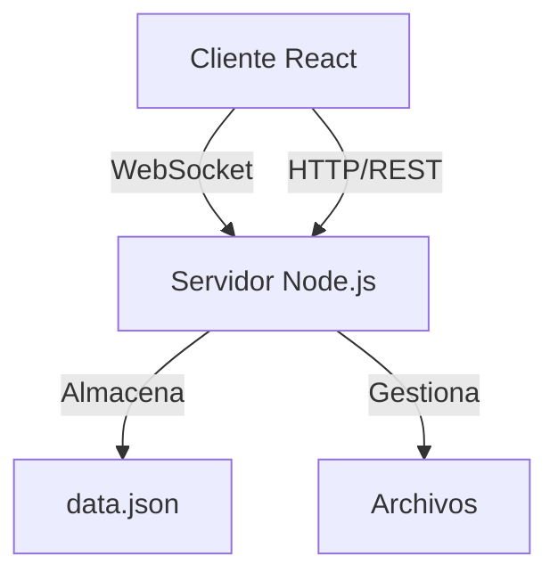

# 💬 M06-PR7-CHATS

> Aplicación web de mensajería en tiempo real y edición colaborativa de documentos para entornos educativos.

<div align="center">


</div>

> 💡 **¿Tienes preguntas sobre este repositorio?** [](https://deepwiki.com/JowiMesas/M06-PR7-CHATS-JoelVictorManuel) para obtener más información.

## 📋 Características Principales

- **Chat en tiempo real** con WebSockets
- **Documentos colaborativos** con sincronización automática
- **Gestión de archivos** con previsualización
- **Interfaz responsive** y moderna
- **Autenticación** sencilla e intuitiva

## 🚀 Instalación y Configuración

### Requisitos previos

- Node.js (v14.x o superior)
- npm o yarn

### Paso 1: Clonar el repositorio

```bash
git clone https://github.com/JowiMesas/M06-PR7-CHATS-JoelVictorManuel.git
cd M06-PR7-CHATS-JoelVictorManuel
```

### Paso 2: Configurar el backend

```bash
cd server
npm install

# Iniciar el servidor (desarrollo)
npm run dev
```

> El servidor estará disponible en: http://localhost:4000

### Paso 3: Configurar el frontend

```bash
cd ../client
npm install

# Iniciar la aplicación en modo desarrollo
npm run dev
```

> La aplicación estará disponible en: http://localhost:5173

## 🌐 Arquitectura



## 📦 Estructura del proyecto

<details>
<summary>Ver estructura completa</summary>

```
M06-PR7-CHATS-JoelVictorManuel/
├── server/
│   ├── controllers/
│   │   ├── authController.js
│   │   ├── chatController.js
│   │   ├── documentController.js
│   │   └── fileController.js
│   ├── data/
│   │   └── data.json
│   ├── routes/
│   │   ├── authRoutes.js
│   │   ├── chatRoutes.js
│   │   ├── documentRoutes.js
│   │   └── fileRoutes.js
│   ├── uploads/
│   ├── index.js
│   ├── package.json
│   └── package-lock.json
└── client/
    ├── package.json
    ├── package-lock.json
    └── src/
        ├── main.tsx
        ├── App.tsx
        ├── index.css
        ├── assets/
        │   └── react.svg
        ├── components/
        │   ├── Chat.tsx
        │   ├── DocumentList.tsx
        │   ├── DocumentEditor.tsx
        │   ├── FileUpload.tsx
        │   └── FileList.tsx
        ├── contexts/
        │   └── AuthContext.tsx
        ├── pages/
        │   ├── LoginPage.tsx
        │   └── Dashboard.tsx
        ├── services/
        │   ├── authService.ts
        │   ├── chatService.ts
        │   ├── documentService.ts
        │   ├── fileService.ts
        │   └── socketService.ts
        ├── types/
        │   ├── User.ts
        │   ├── Chat.ts
        │   └── Document.ts
        └── App.css
```
</details>

## 📝 Funcionalidades detalladas

### 👤 Autenticación

- Login simplificado (almacenamiento en `localStorage`)
- Protección de rutas con `AuthContext`
- Experiencia de usuario fluida

### 💬 Chat en tiempo real

- Comunicación instantánea vía WebSockets
- Historial persistente
- Exportación en formato `.txt` y `.json`
- Notificaciones de nuevos mensajes

### 📄 Documentos colaborativos

- Edición en tiempo real con múltiples usuarios
- Autoguardado automático
- Visualización de cambios en directo
- Exportación en formatos `.txt` y `.pdf`

### 📁 Gestión de archivos

- Subida de archivos con restricciones seguras
- Descarga directa desde la interfaz
- Soporte para múltiples formatos (PDF, imágenes, texto)
- Límite de tamaño: 5MB

## 🔌 API Endpoints

| Método | Ruta                         | Descripción                   |
|--------|------------------------------|-------------------------------|
| POST   | `/api/login`                 | Iniciar sesión                |
| GET    | `/api/chat/view_hist`        | Obtener historial             |
| POST   | `/api/chat/send_message`     | Enviar mensaje                |
| GET    | `/api/doc`                   | Listar documentos             |
| GET    | `/api/doc/:docId`            | Obtener documento             |
| POST   | `/api/doc`                   | Crear documento               |
| GET    | `/api/doc/export/txt/:docId` | Exportar como texto           |
| GET    | `/api/doc/export/pdf/:docId` | Exportar como PDF             |
| POST   | `/api/files/upload`          | Subir archivo                 |
| GET    | `/api/files/list`            | Listar archivos               |
| GET    | `/api/files/download/:name`  | Descargar archivo             |

## 🛠️ Stack tecnológico

### Frontend
- **React** - Biblioteca de UI
- **TypeScript** - Tipado estático
- **Vite** - Build tool y dev server
- **Tailwind CSS** - Framework CSS utilitario

### Backend
- **Node.js** - Runtime de JavaScript
- **Express** - Framework web
- **WS** - Implementación de WebSockets
- **Multer** - Middleware para subida de archivos
- **PDFKit** - Generación de PDFs

### Almacenamiento
- Datos persistidos en `data.json`
- Archivos almacenados en directorio `uploads/`

## 🤝 Contribuciones

¡Las contribuciones son bienvenidas! Si encuentras un error o tienes una mejora:

1. Haz fork del repositorio
2. Crea una rama para tu feature (`git checkout -b feature/amazing-feature`)
3. Realiza tus cambios y haz commit (`git commit -m 'Add some amazing feature'`)
4. Push a la rama (`git push origin feature/amazing-feature`)
5. Abre un Pull Request

## 📜 Licencia

© 2025 Centro Educativo - Todos los derechos reservados

---

<div align="center">
Desarrollado por Joel, Victor y Manuel para el módulo M06-PR7
</div>
